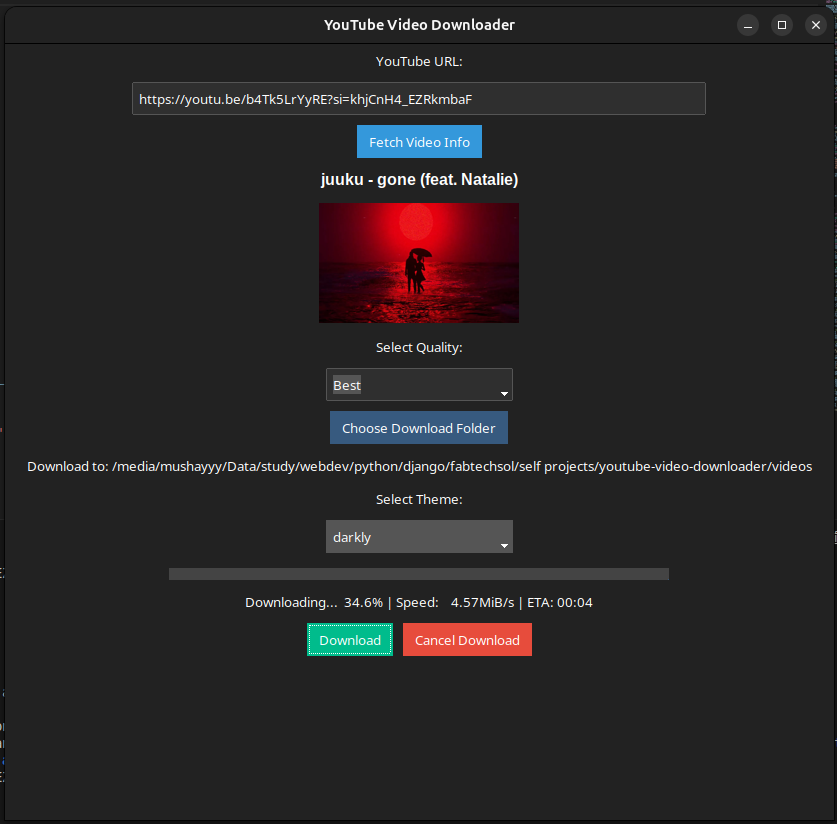
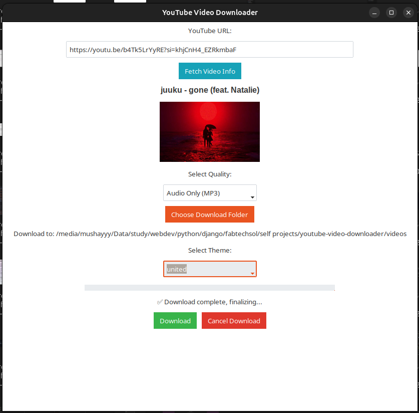
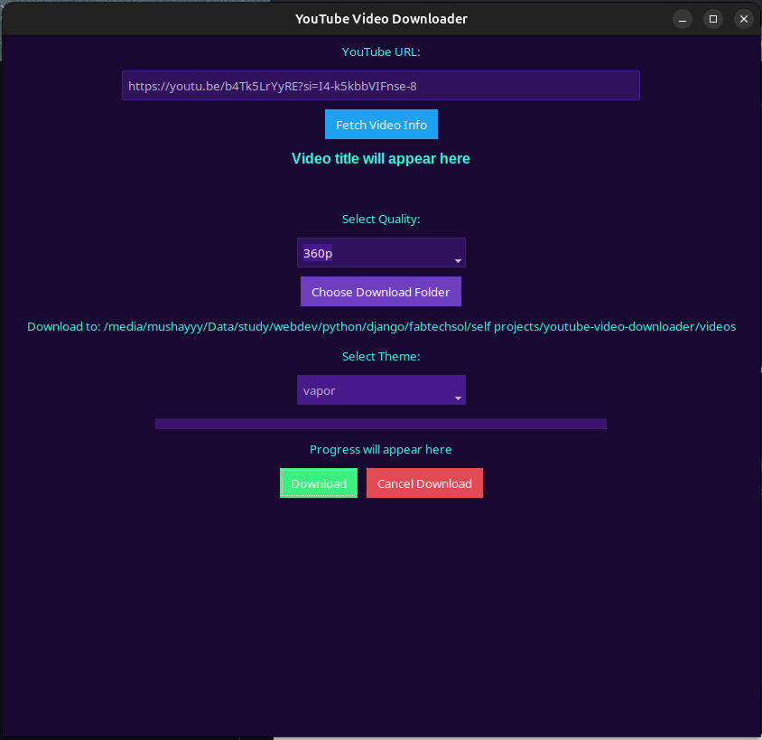

# YouTube Video Downloader (GUI)

A **desktop GUI application** to download YouTube videos and audio with multiple quality options. Built with **Python**, **Tkinter**, and **TkBootstrap**, it features a clean modern interface, download progress tracking, download history, theme selection, and the ability to cancel ongoing downloads.

---

## Features

- Download YouTube videos in multiple resolutions: **360p, 480p, 720p, 1080p, Best**  
- Download audio only as **MP3**  
- **Fetch video info** (title + thumbnail) before downloading  
- **Progress bar** with speed and ETA  
- **Cancel button** for ongoing downloads  
- **Theme selection** using `ttkbootstrap` (darkly default, many others available)  
- Fully **cross-platform** for Linux (requires Python + Tkinter)  

---

## Screenshots

  
  
  

---

## Installation

1. Clone the repository:

```bash
git clone https://github.com/yourusername/youtube-downloader-gui.git
cd youtube-downloader-gui
```

2. Install required Python packages:

```bash
pip install yt-dlp ttkbootstrap Pillow requests
or 
pip install -r requirements.txt
```

3. Run the application:

```bash
python gui_downloader.py
```

---

## Building Standalone Executable (Linux)

```bash
sudo apt install python3-tk tcl8.6-dev tk8.6-dev
pip install pyinstaller
pyinstaller --onefile --windowed --hidden-import=PIL._tkinter_finder --icon=icon.png gui_downloader.py
./dist/gui_downloader
```

---

## Usage

1. Enter a YouTube URL.  
2. Click **Fetch Video Info** to preview title and thumbnail.  
3. Select **video quality** or **audio only**.  
4. Choose a **download folder**.  
5. Click **Download** to start.  
6. Optionally **Cancel Download** if needed.  
7. Change **theme** using the dropdown.

---

## Dependencies

- Python 3.x  
- [yt-dlp](https://github.com/yt-dlp/yt-dlp)  
- [TkBootstrap](https://github.com/israel-dryer/ttkbootstrap)  
- [Pillow](https://python-pillow.org/)  
- [Requests](https://docs.python-requests.org/en/latest/)  

---

## Future Improvements

- Windows standalone `.exe` build  
- Support for playlists  
- Multi-threaded batch downloads  

